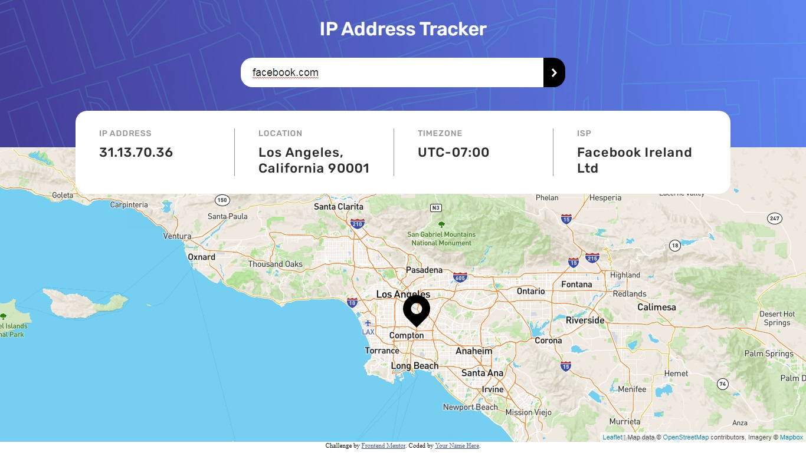

# Frontend Mentor - IP address tracker solution

This is a solution to the [IP address tracker challenge on Frontend Mentor](https://www.frontendmentor.io/challenges/ip-address-tracker-I8-0yYAH0). Frontend Mentor challenges help you improve your coding skills by building realistic projects. 

### The challenge

Users should be able to:

- View the optimal layout for each page depending on their device's screen size
- See hover states for all interactive elements on the page
- See their own IP address on the map on the initial page load
- Search for any IP addresses or domains and see the key information and location

### Screenshot

### Links

- Solution URL: [https://github.com/bilgicbe/ip-address-tracker/](https://github.com/bilgicbe/ip-address-tracker/)
- Live Site URL: [https://bilgicbe.github.io/ip-address-tracker](https://bilgicbe.github.io/ip-address-tracker/)

## My process

### Built with

- Semantic HTML5 markup
- CSS custom properties
- Flexbox
- Mobile-first workflow
- [LeafletJS](https://leafletjs.com/) - Javascript Map Library
- [Mapbox](https://mapbox.com/) - Map Tiles
- [Ipify](https//geo.ipify.org) - IP Geolocation API

